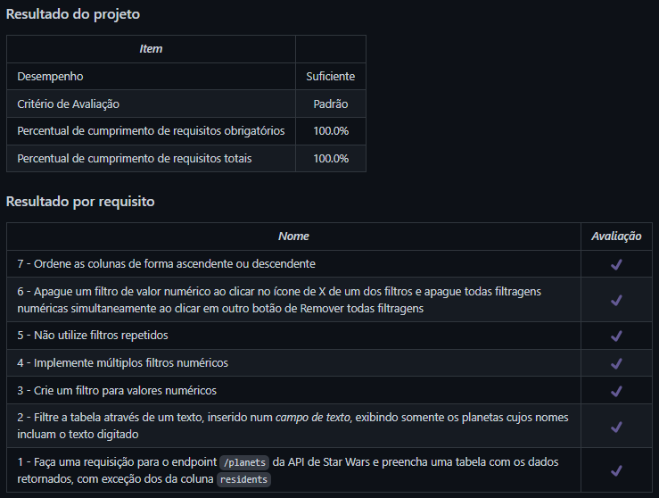

# StarWars Planets Search
Projeto da [Trybe](https://www.betrybe.com/) - Bloco 17 - Aplicação de jogo de busca de planetas do Star Wars feita com React, utilizando Context API e React Hooks.

## 💻 Projeto

Aplicação que lista e filtra os planetas do universo de Star Wars usando Context API e Hooks para controlar os estados globais.

<details>
  <summary><strong>🏆 Meu desempenho</strong></summary><br />

  
</details>

## 🚀 Tecnologias
> Este projeto foi desenvolvido com as seguintes tecnologias:

- JavaScript
- React
- Contex API
- React Hooks

## 📌 Habilidades

> Neste projeto, desenvolvi as seguintes habilidades:

- Utilizar a Context API do React para gerenciar estado;
- Utilizar os React Hooks useContext, useState e useEffect;
- Criar React Hooks customizados.

## ⬇️ Instalando dependências

```bash
npm install
``` 

## ⚡ Executando a aplicação

```bash
npm start
``` 

## 🧪 Executando os testes

```bash
npm test
```

## 💬 Contatos

<div align="center" style="display: inline_block">
  <a href="https://julianoboese.github.io" target="_blank"></a> 
  <a href="https://www.linkedin.com/in/julianoboese" target="_blank"></a> 
  <a href = "mailto:juliano.boese@gmail.com"></a>
</div>

<!-- ## 📄 Licença

Esse projeto está sob licença. Veja o arquivo [LICENÇA](LICENSE.md) para mais detalhes.

[⬆ Voltar ao topo](#nome-do-projeto)<br> -->
